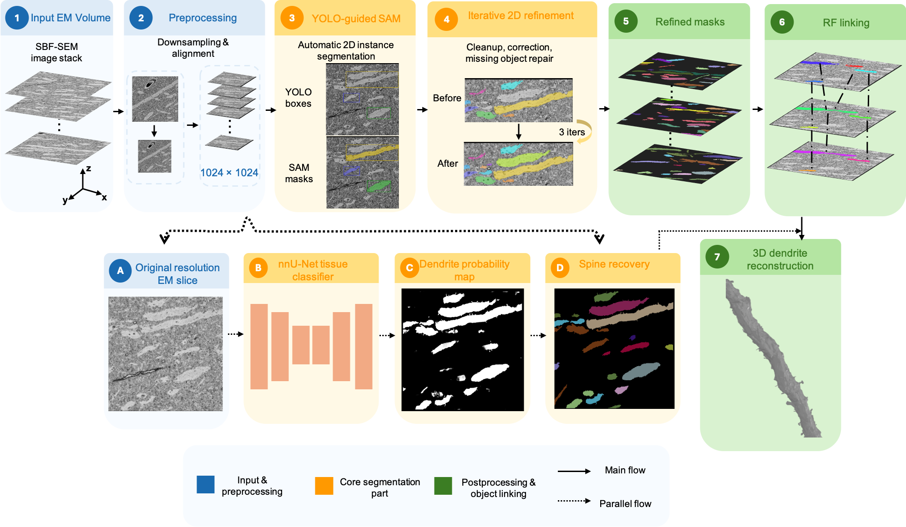
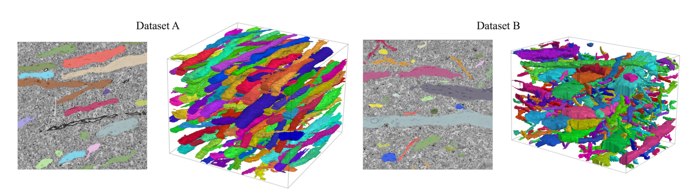

# 3D dendrite instance segmentation in SBF-SEM

A fully automatic pipeline that segments individual dendrites in 3D from serial block-face electron microscopy (SBF-SEM) stacks. A YOLOv6 detector finds dendrites on every slice. 


Qualitative results:


> **Follow the steps below in order.** Each step uses the output of the one before it, so skipping or reordering steps will break the pipeline.

1. **Align the stack.** Align the low-resolution stack with the StackReg plugin in Fiji, then use `alignment/inverse_alignment.py` to apply the same shifts to the high-resolution stack. Both resolutions are used later, so they have to stay in the same space.
2. **Detect dendrites.** Run the trained YOLOv6 model on the low-res slices and save the boxes as txt files. See `training/yolov6` and `pipeline/README.md`.
3. **Segment and link.** Run `pipeline/main.py`. It prompts SAM with the boxes, cleans the masks, recovers missed objects over three iterations and links everything into 3D with the random forest.
4. **Remove tiny objects.** Run `pipeline/filter_small_objects.py` on the linked volume.
5. **Recover detail at full resolution.** Run nnU-Net on the high-res slices, then the three scripts in `highres_recovery/`.
6. **Clean up in 3D.** Run `postprocessing/run_postprocessing.py`. 
7. **Evaluate.** If you have annotated slices, run `evaluation/evaluate.py`.

Please check our paper:
```bibtex
@misc{zhuo2026fullyautomaticpipeline3d,
      title={A Fully Automatic Pipeline for 3D Dendrite Instance Segmentation in SBF-SEM}, 
      author={Zewen Zhuo and Ilya Belevich and Eija Jokitalo and Alejandra Sierra and Jussi Tohka},
      year={2026},
      eprint={2610.03332},
      archivePrefix={arXiv},
      primaryClass={cs.CV},
      url={https://arxiv.org/abs/2610.03332}, 
}
```

   
```
dendrite-3d-instance-seg/
├── README.md
├── LICENSE.md
├── requirements.txt
├── fig1.png                        # pipeline overview
├── quality_view.png                # example results
│
├── alignment/                      # step 1
│   ├── README.md
│   └── inverse_alignment.py        # applies the low-res shifts to the high-res stack
│
├── pipeline/                       # steps 3 and 4
│   ├── README.md
│   ├── main.py                     # SAM with YOLO boxes, 2D cleanup, 3 iterations, RF linking
│   ├── functions.py                # helpers for boxes, reading slices and 2D cleanup
│   ├── inference_lib.py            # runs SAM with box prompts (adapted from micro-sam)
│   └── filter_small_objects.py     # removes small 3D objects after linking
│
├── highres_recovery/               # step 5
│   ├── README.md
│   ├── stack_nnunet_probs.py       # per-slice nnU-Net probabilities -> one 3D array
│   ├── upscale_instances.py        # low-res instances -> full resolution
│   └── refine_with_nnunet.py       # adds confident nnU-Net regions to each instance
│
├── postprocessing/                 # step 6
│   ├── README.md
│   ├── run_postprocessing.py       # repair in the x view, merge, harmonize ids
│   └── pipeline_utils.py           # functions used by run_postprocessing.py
│
├── evaluation/                     # step 7
│   ├── README.md
│   └── evaluate.py                 # instance, panoptic and semantic metrics on sparse GT
│
└── training/                       # how each model was trained
    ├── yolov6/
    │   └── README.md               # training setup, weights link
    ├── SAM_finetune/
    │   └── README.md               # points to DendriteSAM, weights link
    ├── nnunet/
    │   ├── README.md               # training commands, weights link
    │   └── dataset.json
    └── rf_linker/
        ├── README.md
        ├── extract_features.py     # builds the edge table from 3D ground truth
        ├── rf_training.py          # trains the random forest
        ├── run_linking.py          # links a segmentation with a trained model
        ├── train_edges.csv         # the edge table used for training
        └── infer/
            ├── __init__.py
            ├── infer.py            # builds and scores edges between slices
            └── greedy.py           # turns scored edges into 3D tracks
```
